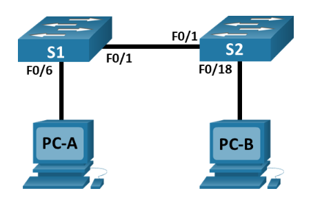

# Packet Tracer - Basic Switch and End Device Configuration - Physical Mode

## Topology



## Addressing Table

| Device | Interface | IP Address   | Subnet Mask   |
| ------ | --------- | ------------ | ------------- |
| S1     | VLAN 1    | 192.168.1.1  | 255.255.255.0 |
| S2     | VLAN 1    | 192.168.1.2  | 255.255.255.0 |
| PC-A   | NIC       | 192.168.1.10 | 255.255.255.0 |
| PC-B   | NIC       | 192.168.1.11 | 255.255.255.0 |

## Objectives

- Part 1: Set Up the Network Topology
- Part 2: Configure PC Hosts
- Part 3: Configure and Verify Basic Switch Settings

## Background / Scenario

In this Packet Tracer Physical Mode (PTPM) activity, you will build a simple network with two hosts and two switches. You will also configure basic settings including hostname, local passwords, and login banner. Use show commands to display the running configuration, IOS version, and interface status. Use the copy command to save device configurations.

You will apply IP addressing for to the PCs and switches to enable communication between the devices. Use the ping utility to verify connectivity.

## Instructions

### Part 1: Set Up the Network Topology

Power on the PCs and cable the devices according to the topology. To select the correct port on a switch, right click and select Inspect Front. Use the Zoom tool, if necessary. Float your mouse over the ports to see the port numbers. Packet Tracer will score the correct cable and port connections.

a. There are several switches, routers, and other devices on the Shelf. Click and drag switches S1 and S2 to the Rack. Click and drag two PCs to the Table.

b. Power on the PCs.

c. On the Cable Pegboard, click a Copper Cross-Over cable. Click the FastEthernet0/1 port on S1 and then click the FastEthernet0/1 port on S2 to connect them. You should see the cable connecting the two ports.

d. On the Cable Pegboard, click a Copper Straight-Through cable. Click the FastEthernet0/6 port on S1 and then click the FastEthernet0 port on PC-A to connect them.

e. On the Cable Pegboard, click a Copper Straight-Through cable. Click the FastEthernet0/18 port on S2 and then click the FastEthernet0 port on PC-B to connect them.

f. Visually inspect network connections. Initially, when you connect devices to a switch port, the link lights will be amber. After a minute or so, the link lights will turn green.

### Part 2: Configure PC Hosts

Configure static IP address information on the PCs according to the Addressing Table.

a. Click PC-A > Desktop > IP Configuration. Enter the IP address for PC-A (192.168.1.10) and the subnet mask (255.255.255.0), as listed in the IP addressing table. You can leave default gateway blank at this time because there is no router attached to the network.

b. Close the PC-A window.

c. Repeat the previous steps to assign the IP address information for PC-B, as listed in the Addressing Table.

d. Click PC-A > Desktop > Command Prompt. Use the ipconfig /all command at the prompt to verify settings.

e. Enter ping 192.168.1.11 at the prompt to test the connectivity to PC-B. The ping should be successful, as shown in the following output. If the ping is not successful, check the configurations on both of the PCs and troubleshoot as necessary.

```cmd
Packet Tracer PC Command Line 1.0
C:\> ping 192.168.1.11
Pinging 192.168.1.11 with 32 bytes of data:
Reply from 192.168.1.11: bytes=32 time<1ms TTL=128
Reply from 192.168.1.11: bytes=32 time<1ms TTL=128
Reply from 192.168.1.11: bytes=32 time<1ms TTL=128
Reply from 192.168.1.11: bytes=32 time<1ms TTL=128
Ping statistics for 192.168.1.11:
Packets: Sent = 4, Received = 4, Lost = 0 (0% loss),
Approximate round trip times in milli-seconds:
Minimum = 0ms, Maximum = 0ms, Average = 0ms
C:\>
```

### Part 3: Configure and Verify Basic Switch Settings

a. On the Cable Pegboard, click a Console cable. Connect the console cable between S1 and PC-A.

b. Establish a console connection to the switch S1 from PC-A using the Packet Tracer generic Terminal program (PC-A > Desktop > Terminal). Press ENTER to get the Switch> prompt.

c. You can access all switch commands in privileged EXEC mode. The privileged EXEC command set includes those commands contained in user EXEC mode, as well as the configure command through which access to the remaining command modes are gained. Enter privileged EXEC mode by entering the enable command.

```cmd
Switch> enable
Switch#
```

d. The prompt changed from Switch> to Switch# which indicates privileged EXEC mode. Enter global configuration mode.

```cmd
Switch# configure terminal
Switch(config)#
```

e. The prompt changed to Switch(config)# to reflect global configuration mode. Give the switch a name according to the Addressing Table.

```cmd
Switch(config)# hostname S1
S1(config)#
```

f. Enter local passwords. Use class as the privileged EXEC password and cisco as the password for console access.

```cmd
S1(config)# enable password class
S1(config)# line console 0
S1(config-line)# password cisco
S1(config-line)# login
S1(config-line)# exit
```

g. Configure and enable the VLAN 1 interface according to the Addressing Table.

```cmd
S1(config)# interface vlan 1
S1(config-if)# ip address 192.168.1.1 255.255.255.0
S1(config-if)# no shutdown
S1(config-if)# exit
```

h. A login banner, known as the message of the day (MOTD) banner, should be configured to warn anyone accessing the switch that unauthorized access will not be tolerated. Configure an appropriate MOTD banner to warn about unauthorized access.

```cmd
S1(config)# banner motd #WARNING: Unauthorized access is strictly prohibited!#
```

i. Save the configuration to the startup file on non-volatile random access memory (NVRAM).

```cmd
S1(config)# exit
S1# copy running-config startup-config
Destination filename [startup-config]? [Enter]
Building configuration...
[OK]
```

j. Display the current configuration.

```cmd
show running-config
```

k. Display the IOS version and other useful switch information.

```cmd
show version
```

l. Display the status of the connected interfaces on the switch.

```cmd
show ip interface brief
```

m. Repeat the previous steps to configure switch S2. Make sure the hostname is configured as S2.

n. Record the interface status for the following interfaces.

| Interface | S1 Status | S1 Protocol | S2 Status | S2 Protocol |
| --------- | --------- | ----------- | --------- | ----------- |
| F0/1      | up        | up          | up        | up          |
| F0/6      | up        | up          | down      | down        |
| F0/18     | down      | down        | up        | up          |
| VLAN 1    | up        | up          | up        | up          |

o. From a PC, ping S1 and S2. The pings should be successful.

```cmd
C:\> ping 192.168.1.1
C:\> ping 192.168.1.2
```

p. From a switch, ping PC-A and PC-B. The pings should be successful.

```cmd
S1# ping 192.168.1.10
S1# ping 192.168.1.11
```

## Reflection Questions

### Why are some FastEthernet ports on the switches up while others are down?

FastEthernet ports on the switches are only "up" when they are connected to another device that is also powered on. In this topology, we only connected specific ports:

- F0/1 on both switches (connected to each other)
- F0/6 on S1 (connected to PC-A)
- F0/18 on S2 (connected to PC-B)

All other ports remain in a "down" state because they don't have any active connections.

### What could prevent a ping from being sent between the PCs?

1. Incorrect IP addressing - If either PC has the wrong IP address or subnet mask configured
2. Network connectivity problems - If cables are disconnected or connected to wrong ports
3. Switch configuration issues - If the switches have incorrect VLAN configurations or port settings
4. Interface status - If any of the interfaces in the path between PCs is down
5. IP configuration issues - If the PCs are configured on different subnets without a router
6. Switch IP addressing problems - If the switches have incorrect IP addresses on VLAN 1
