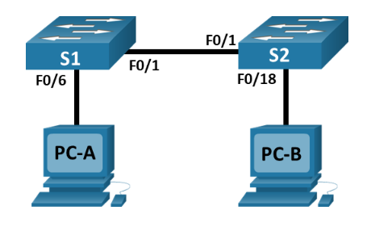

# Lab - View the Switch MAC Address Table

## Topology



## Addressing Table

| Device | Interface | IP Address   | Subnet Mask   |
|--------|-----------|-------------|---------------|
| S1     | VLAN 1    | 192.168.1.11| 255.255.255.0 |
| S2     | VLAN 1    | 192.168.1.12| 255.255.255.0 |
| PC-A   | NIC       | 192.168.1.1 | 255.255.255.0 |
| PC-B   | NIC       | 192.168.1.2 | 255.255.255.0 |

## Objectives

**Part 1:** Build and Configure the Network  
**Part 2:** Examine the Switch MAC Address Table

## Background / Scenario

The purpose of a Layer 2 LAN switch is to deliver Ethernet frames to host devices on the local network. The switch records host MAC addresses that are visible on the network, and maps those MAC addresses to its own Ethernet switch ports. This process is called building the MAC address table. When a switch receives a frame from a PC, it examines the frame's source and destination MAC addresses. The source MAC address is recorded and mapped to the switch port from which it arrived. Then the destination MAC address is looked up in the MAC address table. If the destination MAC address is a known address, then the frame is forwarded out of the corresponding switch port associated with that MAC address. If the MAC address is unknown, then the frame is broadcasted out of all switch ports, except the one from which it came. It is important to observe and understand the function of a switch and how it delivers data on the network. The way a switch operates has implications for network administrators whose job it is to ensure secure and consistent network communication.

Switches are used to interconnect and deliver information to computers on local area networks. Switches deliver Ethernet frames to host devices identified by network interface card MAC addresses.

In Part 1, you will build a multi-switch topology with a trunk linking the two switches. In Part 2, you will ping various devices and observe how the two switches build their MAC address tables.

**Note:** The switches used are Cisco Catalyst 2960s with Cisco IOS Release 15.2(2) (lanbasek9 image). Other switches and Cisco IOS versions can be used. Depending on the model and Cisco IOS version, the commands available and output produced might vary from what is shown in the labs.

**Note:** Make sure that the switches have been erased and have no startup configurations. If you are unsure contact your instructor.

## Required Resources

- 2 Switches (Cisco 2960 with Cisco IOS Release 15.2(2) lanbasek9 image or comparable)
- 2 PCs (Windows with terminal emulation program, such as Tera Term)
- Console cables to configure the Cisco IOS devices via the console ports
- Ethernet cables as shown in the topology

**Note:** The Fast Ethernet interfaces on Cisco 2960 switches are autosensing and an Ethernet straight-through cable may be used between switches S1 and S2. If using another model Cisco switch, it may be necessary to use an Ethernet crossover cable.

## Instructions

### Part 1: Build and Configure the Network

#### Step 1: Cable the network according to the topology

#### Step 2: Configure PC hosts

#### Step 3: Initialize and reload switches as necessary

#### Step 4: Configure basic settings for each switch

a. Configure device name as shown in the topology.
b. Configure IP address as listed in Addressing Table.
c. Assign cisco as the console and vty passwords.
d. Assign class as the privileged EXEC password.

### Part 2: Examine the Switch MAC Address Table

A switch learns MAC addresses and builds the MAC address table, as network devices initiate communication on the network.

#### Step 1: Record network device MAC addresses

a. Open a command prompt on PC-A and PC-B and type ipconfig /all.

**Question:**
What are the Ethernet adapter physical addresses?

PC-A MAC Address:

> 0009.7C61.30A0

PC-B MAC Address:

> 0009.7C61.30A0

b. Console into switch S1 and S2 and type the `show interface F0/1` command on each switch.

**Questions:**
On the second line of command output, what is the hardware addresses (or burned-in address [bia])?

S1 Fast Ethernet 0/1 MAC Address:

> bia 0001.c987.2201

S2 Fast Ethernet 0/1 MAC Address:

> bia 0090.2189.2701

#### Step 2: Display the switch MAC address table

Console into switch S2 and view the MAC address table, both before and after running network communication tests with ping.

a. Establish a console connection to S2 and enter privileged EXEC mode.

b. In privileged EXEC mode, type the show mac address-table command and press Enter.

```cli
show mac address-table
```

Even though there has been no network communication initiated across the network (i.e., no use of ping), it is possible that the switch has learned MAC addresses from its connection to the PC and the other switch.

**Questions:**
Are there any MAC addresses recorded in the MAC address table?

> Yes

What MAC addresses are recorded in the table? To which switch ports are they mapped and to which devices do they belong? Ignore MAC addresses that are mapped to the CPU.

```cli
Vlan    Mac Address       Type        Ports
----    -----------       --------    -----

   1    0001.c987.2201    DYNAMIC     Fa0/1
```

> Belongs to the S1 switch

If you had not previously recorded MAC addresses of network devices in Step 1, how could you tell which devices the MAC addresses belong to, using only the output from the show mac address-table command? Does it work in all scenarios?

> You could match the port numbers in the MAC address table with the physical connections you know about - like if a MAC is on port F0/1 and you know PC-A connects there, that's PC-A's MAC. But this only works if you're sure about which device connects to which port. It gets confusing in bigger networks or if devices move around. Plus, if multiple devices connect through the same port (like through another switch), you can't tell which MAC belongs to which device just from the table. So it's not reliable in all situations.

#### Step 3: Clear the S2 MAC address table and display the MAC address table again

a. In privileged EXEC mode, type the `clear mac address-table dynamic` command and press Enter.

```cli
clear mac address-table dynamic
```

b. Quickly type the `show mac address-table` command again.

**Questions:**
Does the MAC address table have any addresses in it for VLAN 1? Are there other MAC addresses listed?

> No

Wait 10 seconds, type the show mac address-table command, and press Enter. Are there new addresses in the MAC address table?

> Yes, 0001.c987.2201

#### Step 4: From PC-B, ping the devices on the network and observe the switch MAC address table

a. From PC-B, open a command prompt and type arp -a.

**Question:**
Not including multicast or broadcast addresses, how many device IP-to-MAC address pairs have been learned by ARP?

> None

b. From the PC-B command prompt, ping PC-A, S1, and S2.

**Question:**
Did all devices have successful replies? If not, check your cabling and IP configurations.

```txt
C:\>ping 192.168.1.1

Pinging 192.168.1.1 with 32 bytes of data:

Reply from 192.168.1.1: bytes=32 time<1ms TTL=128
Reply from 192.168.1.1: bytes=32 time<1ms TTL=128
Reply from 192.168.1.1: bytes=32 time<1ms TTL=128
Reply from 192.168.1.1: bytes=32 time<1ms TTL=128

Ping statistics for 192.168.1.1:
    Packets: Sent = 4, Received = 4, Lost = 0 (0% loss),
Approximate round trip times in milli-seconds:
    Minimum = 0ms, Maximum = 0ms, Average = 0ms

C:\>ping 192.168.1.11

Pinging 192.168.1.11 with 32 bytes of data:

Request timed out.
Reply from 192.168.1.11: bytes=32 time<1ms TTL=255
Reply from 192.168.1.11: bytes=32 time<1ms TTL=255
Reply from 192.168.1.11: bytes=32 time<1ms TTL=255

Ping statistics for 192.168.1.11:
    Packets: Sent = 4, Received = 3, Lost = 1 (25% loss),
Approximate round trip times in milli-seconds:
    Minimum = 0ms, Maximum = 0ms, Average = 0ms

C:\>ping 192.168.1.12

Pinging 192.168.1.12 with 32 bytes of data:

Request timed out.
Reply from 192.168.1.12: bytes=32 time<1ms TTL=255
Reply from 192.168.1.12: bytes=32 time=9ms TTL=255
Reply from 192.168.1.12: bytes=32 time<1ms TTL=255

Ping statistics for 192.168.1.12:
    Packets: Sent = 4, Received = 3, Lost = 1 (25% loss),
Approximate round trip times in milli-seconds:
    Minimum = 0ms, Maximum = 9ms, Average = 3ms
```

c. From a console connection to S2, enter the `show mac address-table` command.

**Question:**
Has the switch added additional MAC addresses to the MAC address table? If so, which addresses and devices?

```txt
          Mac Address Table
-------------------------------------------

Vlan    Mac Address       Type        Ports
----    -----------       --------    -----

   1    0001.c987.2201    DYNAMIC     Fa0/1
   1    0009.7c61.30a0    DYNAMIC     Fa0/1
   1    0009.7cd0.9ae5    DYNAMIC     Fa0/18
   1    0010.1118.049b    DYNAMIC     Fa0/1
```

From PC-B, open a command prompt and retype arp -a.

**Question:**
Does the PC-B ARP cache have additional entries for all network devices that were sent pings?

```txt
Internet Address      Physical Address      Type
  192.168.1.1           0009.7c61.30a0        dynamic
  192.168.1.11          0010.1118.049b        dynamic
  192.168.1.12          0010.1172.1e16        dynamic
```

## Reflection Question

On Ethernet networks, data is delivered to devices by their MAC addresses. For this to happen, switches and PCs dynamically build ARP caches and MAC address tables. With only a few computers on the network this process seems fairly easy. What might be some of the challenges on larger networks?

> 1. Table size limitations - Switches can only remember so many MAC addresses before they run out of space
> 2. Broadcast storms - When tons of devices are looking for each other, the network gets flooded with "who has this address?" messages
> 3. Security issues - It's super hard to spot when someone plugs in something they shouldn't
> 4. Troubleshooting difficulty - Good luck finding which device is causing problems when you have hundreds to check
> 5. Update delays - the switch might not keep up when lots of people connect and disconnect at once
